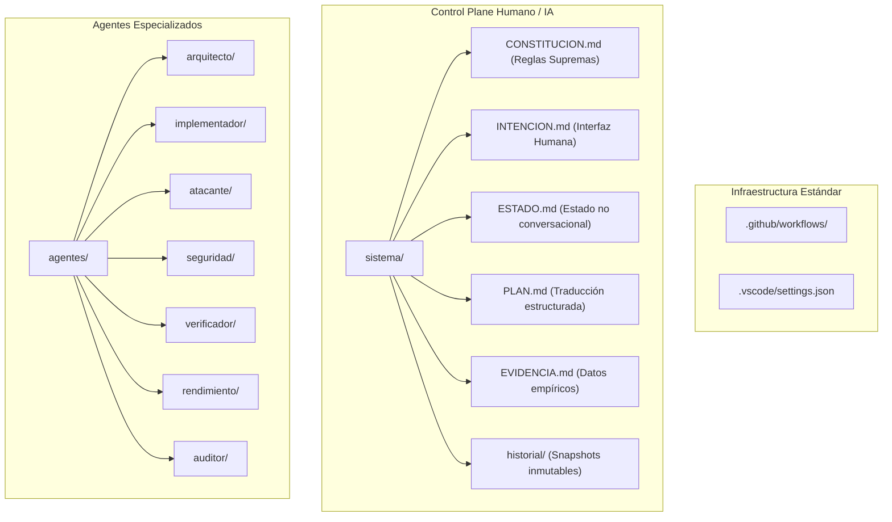

# Auditoría del Sistema Actual e Inventario Factual
> **Fecha:** 2026-10-01  
> **Fase:** Fase 0 — Congelación y Auditoría (Orden 01)  
> **Alcance:** Inventario físico completo del repositorio `ipvn7_0.7`, identificación de referencias cruzadas, evaluación de infraestructura, categorización (`KEEP`, `MOVE`, `REPLACE`, `DELETE`, `UNKNOWN`) y propuesta de migración gobernada.

---

## 1. Estado de Congelación (Orden 01)

En estricto cumplimiento de la **Orden 01**:
- **Cero modificaciones al código fuente Go** (`src/`).
- **Cero creación de funcionalidades o refactorizaciones oportunistas.**
- **Cero acciones destructivas** (ningún archivo eliminado o modificado).
- **Inventario 100% factual** basado en el árbol físico del workspace.

---

## 2. Árbol Físico de Componentes del Repositorio

El repositorio `ipvn7_0.7` se compone actualmente de los siguientes directorios principales:

```text
c:\Users\Frondabrick\Desktop\dvd\Ipv7\0.7\
├── .git/                      # Metadatos del repositorio Git
├── .gitignore                 # Filtros de ignorados (414 bytes)
├── github/                    # [ANOMALÍA P0] Workflows fuera de la ruta estándar .github/
│   └── workflows/
│       ├── test.yml
│       └── release.yml
├── vscode/                    # [ANOMALÍA P1] Settings fuera de la ruta estándar .vscode/
│   └── settings.json
├── agentes/                   # Sistema de agentes previo (parcialmente migrado)
│   ├── AGENTS.md
│   ├── AUTOTASKS.md
│   ├── ROLES.md
│   ├── files_manifest.csv
│   ├── task.lock
│   └── skills/
│       ├── ipvn7-distribution-agent/
│       ├── ipvn7-evangelist-interactive-agent/
│       ├── ipvn7-hil-visual-agent/
│       └── ipvn7-network-os-agent/
├── src/                       # Núcleo de protocolo en lenguaje Go
│   ├── go.mod, go.sum
│   ├── cmd/                   # Binarios: ipvn7, installer, ipvn7-wasm
│   └── pkg/                   # Capas: core, interfaces, l0, l1, l2, wasm
├── wintun/                    # Controladores TUN para Windows (amd64, arm, arm64, x86)
├── sdk/                       # Librerías cliente (Go, Python, Rust, TypeScript)
├── scripts/                   # Scripts PowerShell y Bash de build, ciclo y multisuite
├── docs/                      # Documentación arquitectónica, RFCs, auditorías e investigación
├── guide/                     # Portal web interactivo de documentación humana
├── bin/                       # Binarios pre-construidos y hashes
├── dist/                      # Instaladores y empaquetados distribuidos
├── docker/                    # Dockerfile
├── config/                    # Configuraciones y plantillas de entorno
├── keystore/                  # Identidades y peers confiables
└── data/                      # Archivos de registro local (ipvn7.log, petnames.json)
```

---

## 3. Matriz de Clasificación Factual

Cada componente analizado ha sido clasificado bajo los criterios rigurosos de la auditoría:

| Componente / Ruta | Clasificación | Justificación Técnica |
| :--- | :---: | :--- |
| **`src/`** (cmd, pkg, go.mod, go.sum) | **`KEEP`** | Núcleo de protocolo Go. Cero modificaciones en esta fase. Estable y verificado localmente. |
| **`wintun/`** (binarios y headers) | **`KEEP`** | Driver oficial Wintun necesario para el datapath en Windows. |
| **`sdk/`** (Go, Python, Rust, TypeScript) | **`KEEP`** | SDKs de integración del cliente IPVN7 para agentes y desarrolladores externos. |
| **`docker/Dockerfile`** | **`KEEP`** | Empaquetado en contenedor para despliegue en entornos Linux. |
| **`guide/`** (html, js, css, markdown) | **`KEEP`** | Manual interactivo web para el usuario soberano. |
| **`docs/rfc/`**, **`docs/core/`**, **`docs/research/`** | **`KEEP`** | Especificaciones técnicas y memorias de investigación de valor documental histórico y normativo. |
| **`scripts/build_*.ps1` / `.sh`** | **`KEEP`** | Utilerías de compilación para múltiples plataformas. |
| **`scripts/multisuite/`** | **`KEEP`** | Suites de pruebas automatizadas (fuzzing, chaos, race, zero-copy). |
| **`github/`** | **`MOVE`** | **🔴 P0 Crítico:** GitHub Actions requiere `.github/workflows/`. Actualmente GitHub no ejecuta las pruebas en commit/PR. Debe volver a `.github/`. |
| **`vscode/`** | **`MOVE`** | **🟠 P1 Funcional:** VS Code no carga `vscode/settings.json`. Debe volver a `.vscode/`. |
| **`agentes/`** (estructura actual) | **`REPLACE`** | **🟠 P1 Arquitectural:** Monolito de 4 skills desordenadas. Debe reemplazarse por los 7 roles aislados (`arquitecto`, `implementador`, `atacante`, `seguridad`, `verificador`, `rendimiento`, `auditor`). |
| **`agentes/files_manifest.csv`** | **`REPLACE`** | Contiene rutas obsoletas (`github\workflows\release.yml`, `vscode\settings.json`). Debe sincronizarse con los nombres corregidos con punto. |
| **`docs/README.md`** (Línea 19) | **`REPLACE`** | Referencia rota a `agentes/rules/` (directorio inexistente). Requiere apuntar al marco normativo de `sistema/CONSTITUCION.md`. |
| **`docs/VERIFICATION_REPORT.md`** | **`REPLACE`** | Contiene métricas locales presentadas ambiguamente como certificación total. Debe separar explícitamente "Resultados Locales" de "GitHub Actions CI". |
| **`bin/data/ipvn7.log`** | **`DELETE`** | Archivo de log temporal redundante generado dentro de `bin/`. Los logs del sistema deben residir únicamente en `data/`. |
| **`config/git.ignore`** | **`DELETE`** | Archivo redundante/huérfano (el repositorio utiliza `.gitignore` en la raíz). |
| **`dist/*.exe`**, **`dist/*.zip`**, **`bin/*.exe`** | **`UNKNOWN`** | Binarios y paquetes compilados pesados (~40 MB combinados) presentes en el repositorio Git. Requiere decisión humana sobre si deben eliminarse del control de versiones y manejarse vía GitHub Releases. |
| **`config/firebase_credentials.json`** | **`UNKNOWN`** | Credenciales locales. Verificar si contiene datos reales de producción o tokens de prueba antes de cualquier acción. |

---

## 4. Análisis de Conflictos, Riesgos y Dependencias

### 4.1. Regresión Crítica de CI (P0)
- **Causa:** El commit `ee56f89` renombró `.github/` a `github/`.
- **Efecto:** El archivo `github/workflows/test.yml` existe en disco pero es completamente invisible para el motor de GitHub Actions.
- **Riesgo:** Cualquier PR o commit en la rama remota no ejecuta las pruebas de compilación, tests adversariales ni benchmarks, dejando desprotegido el repositorio.

### 4.2. Inseguridad y Pérdida de Configuración en VS Code (P1)
- **Causa:** El renombrado a `vscode/settings.json`.
- **Efecto:** VS Code no lee estas configuraciones automáticamente.
- **Riesgo asociado:** En dicho archivo figuran directivas como `"antigravity.sandboxMode": false` y `"antigravity.toolExecutionPolicy": "always-proceed"`. Si estas políticas se restauran sin evaluación, anulan los controles de seguridad del entorno.

### 4.3. Enlaces y Rutas Rotas
- `docs/README.md:19` apunta a `agentes/rules/`, ruta que no existe físicamente en el commit actual.
- Los scripts `scripts/autonomous_cycle.ps1` y `scripts/run_autonomous_daemon.ps1` apuntan correctamente a `agentes\task.lock`. Esta referencia debe mantenerse o migrarse de forma planificada sin interrumpir los daemons.

### 4.4. Filtro de Exclusiones en `.gitignore`
- Actualmente ignora `agentes/task.lock` y `keystore/*.key`.
- Se removieron históricamente reglas de carpetas de trabajo temporales (`ag/`, `vsc/`). Se debe constatar que no queden archivos residuales sin ignorar.

---

## 5. Propuesta de Migración hacia el Sistema Gobernado



---

## 6. Criterio de Terminación de Fase 0

- [x] Inventario exhaustivo completado sin supuestos ni invenciones.
- [x] Árbol actual auditado físicamente.
- [x] Categorización `KEEP`, `MOVE`, `REPLACE`, `DELETE`, `UNKNOWN` asignada con rigor técnico.
- [x] Riesgos y dependencias documentados.
- [x] **DETENCIÓN:** Ningún cambio de código o archivo ha sido ejecutado. Esperando revisión y confirmación del usuario para proceder con la Fase 1.
